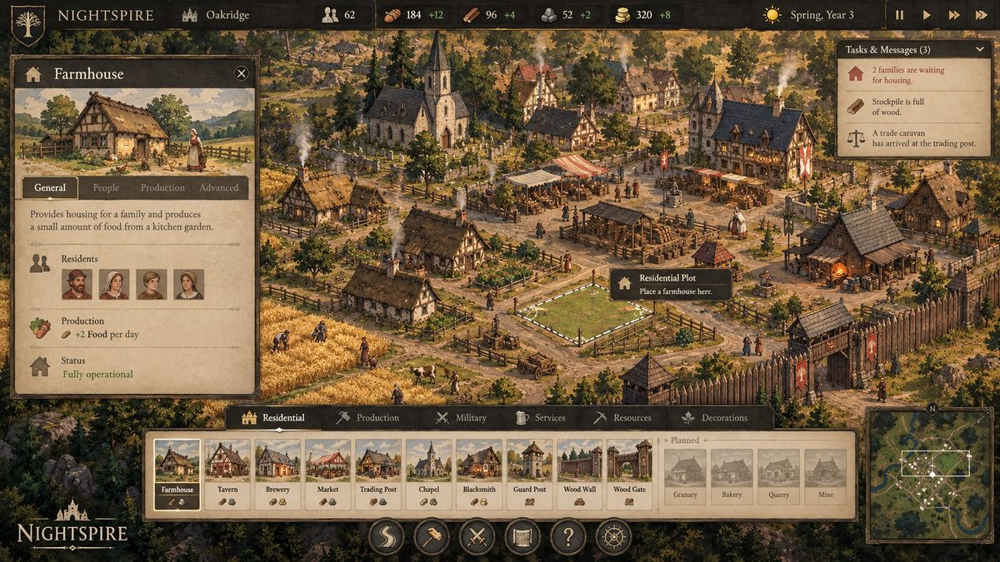

# Nightspire

A grounded medieval dark-fantasy settlement builder. The long-term direction is to grow an organic, lived-in city by day, personally defend it at night, and develop a distinctly adult sensual fantasy society as the settlement matures.

## Product vision & planned feature direction

The image below is the current **north-star UI / presentation concept** for Nightspire. The exact artwork is not final, but the **layout hierarchy and product direction are intentional**: compact settlement information at the top, contextual building/character panels on the left, tasks/messages on the right, a large illustrated construction catalog at the bottom, and the world kept visible in the center.



The playable game already has roads, residential plots, agriculture, physical hauling, Markets, Brewery → Ale → Tavern, Ore → Tools, Gold trade, households, Happiness, immigration, guards, wooden fortifications, raids, day/night and save/load. The roadmap now grows outward from that foundation rather than replacing it.

**Current presentation:** the compact HUD now has original manuscript-style building activity scenes, matching ink-and-cream emblems, worker portraits and parchment/slate framing. Each building uses the same image across construction cards, previews and inspector sizes. See [art direction, assets and remaining limits](docs/MANUSCRIPT_ART.md). Further visual polish remains subject to review.

**Settlement/economy expansion:** deepen food storage and processing with Granary/Bakery-style chains; expand resource extraction with Quarry/Mine-style workplaces; add more agriculture and rural land uses; broaden Markets, trade, logistics, prosperity and upgrade paths.

**Civic, faith and services:** add Well/Chapel/Manor-style civic progression, settlement prestige, policies and faith/service coverage; later grow Bathhouse, recreation, luxury and nightlife into a richer mature-city service economy.

**Defense and night pressure:** extend Guard Posts, Walls and Gates toward Watchtowers/Barracks/stronger fortifications, more enemy archetypes and deeper nightly defense while keeping daytime settlement growth central.

**Scale and character depth:** continue profiling toward larger populations, stronger navigation/job scaling, richer citizens and featured characters, equipment/visual progression, and more detailed household/social simulation.

See [the detailed feature roadmap](docs/FEATURE_ROADMAP.md) and [UI art-slot contract](docs/UI_ART_SLOTS.md). The concept image is a direction reference, not a promise that every pictured building or panel is already implemented.

### Mature service / Pleasure House concept direction

The Pleasure House is an implemented late-settlement service building that should visually belong to the same illustrated medieval UI language as the rest of Nightspire. The first concept establishes the **building panel** direction: large hand-painted header art, workers/visitors, service effects and a restrained parchment information hierarchy.


The second concept establishes the **in-world building and service-space** direction: a warm, affluent multi-level venue with public drinking/entertainment areas, music, private rooms, balconies, courtyards, lanterns, flowers and visible staff/visitors. This is a visual target for layout, atmosphere and readable service activity rather than a literal final asset.


These mature-service concepts remain art-direction references. The gameplay building is implemented; its balance, presentation and final art can continue to evolve.


**Current playable milestone: M3.11.7 — Agriculture & Point-Drawn Farm Fields.** Farming now uses irregular player-drawn land parcels rather than fixed farm tiles. Build a **Farmhouse**, assign up to three Farmers, then use the **Field** tool to click 3–8 corners around the exact land you want to cultivate, with optional grid snapping. Fields reject roads, buildings, residential plots, live resource nodes and other fields. Farmers physically walk to fields to sow and harvest; crops progress across Days through **Fallow → Sown → Growing → Ready → Harvested**, harvest into Farmhouse storage, and general Laborers move the Food onward into specialized Stockpiles and Markets. **Conventional buildings now require road frontage in live placement**, while fields must be linked to a Farmhouse within 18m. Fields share the same global **G** 1m Grid Snap setting as roads and residential dimensions. Field size controls yield and work, so town layout and available labor matter. M3.11.6 Gold trade, household prosperity, local Market coverage and the existing road system remain intact. See [the agriculture note](docs/M3117_AGRICULTURE.md), [the Gold trade note](docs/M3116_GOLD_TRADE.md) and [the household progression note](docs/M3115_HOUSEHOLD_PROGRESSION.md).

**Road visual pass: M3.10.3 — Organic Medieval Roads.** Roads now resolve into one continuous terrain-integrated worn-earth surface with irregular shoulders, width-dependent wear and sparse grass/stone dressing, while preserving the current planner, frontage rules, navigation and save schema. See [the road visual note](docs/M3103_ROAD_VISUALS.md).

**Browser playtest:** https://thobias12.github.io/nightspire/

**Direction pivot:** [Grounded medieval world, organic settlement and mature-city roadmap](docs/DIRECTION_PIVOT.md)

## Seeded regional maps

The [medieval HUD](docs/MEDIEVAL_UI.md) now uses compact icon/count ribbons, portrait construction cards with cost seals, one category/grid rail and compact illustrated building windows. [Original manuscript artwork](docs/MANUSCRIPT_ART.md) covers all 28 live/planned catalog entries; planned art does not unlock additional buildings. Small cards fill their frames with crops of the same scene shown in the wide preview and building header. For artwork fit QA, run the development server and open `/ui-art-fit.html`; it compares every artwork slot without starting gameplay. Hover or focus a card for its name, costs and description. Assign workers below the building illustration, expand Operation & storage under General, and find demolition under Advanced.

New settlements now start on a seeded 257-cell region. Use **Settlement overview → New region** to choose a seed, Meadows/Woodland, and **129, 257 or 513 cells per side** (one metre per cell). Region view, zoom/pan and the clickable minimap let you explore the expanded playable land. Starting another region first saves your current settlement. The playable valley floor remains flat; distant hills are scenery. See [controls, measured timings, verification and limits](docs/REGIONAL_MAPS.md).

## Play locally

Use Node.js 22.12+ (verified here with Node 24.19.0) and npm.

```sh
npm install
npm run dev
```

Open the local URL printed by Vite. A camp begins with six settlers, an empty completed stockpile, 40 nearby trees, 20 food bushes, 12 Ore nodes, and seeded regional resource clusters. Workers automatically gather, carry, and deposit wood and food. No starting materials are needed.

1. Watch stockpile counts rise. Click a settler or resource to inspect its task or remaining yield.
2. Press **0 / Road** and click to place the first road point. Keep clicking to shape the route while the mouse shows a live curved preview; **double-click or Enter** finishes it. **RMB** cancels the active stroke, **Backspace** removes the last committed point, **G** toggles 1m Grid Snap, and holding **Shift** temporarily constrains the next segment to 0°/45°/90°. **F / Road Snap** independently controls magnetic endpoint/centerline joins. **C** cycles Straight/Smooth/Curved and **[ / ]** changes Path/Lane/Main-road width. Snapped intermediate control points also insert persisted junction nodes into the host road.
3. Press **1 / Residential Plot**, start close to a road, then drag diagonally along the desired frontage and backward into the lot. With Grid Snap on, width/depth round to whole metres, the frontage preview shows metre divisions, and starting/ending near an existing lot edge snaps flush to that neighbor. Current limits are 4–10m frontage and 5–13m depth. The resulting House blueprint still costs 20 wood and provides four beds, while the **shape and frontage character** of the lot now matter visually: narrow/deep plots become gable-front long burgage cottages, broad plots can turn their eaves toward the street, front boundaries vary between open/hedged/fenced/gated treatments, and wide/deep plots build stronger L/U-shaped courtyard compositions.
4. Settlers reserve available wood, collect it from a stockpile, carry it to the plotted House site, then perform normal construction work. Cancelling or demolishing that House removes its attached plot.
5. Use hotkeys **2–9** for the remaining buildings. **Road Snap is ON by default**: move a conventional building near a road and its ghost magnetically locks to a tighter roadside grid cell while a larger frontage marker clearly shows which edge will face the street, including diagonal streets. Press **F** to disable Road Snap and use normal grid placement plus **R** rotation. Walls/Gates/Campfire remain manual/grid-oriented.
6. Inspect settlers to see **Food / Housing / Safety / Recreation**, derived Happiness, morale band and current work-rate modifier. Thriving settlers receive a modest productivity bonus; low Happiness slows gathering/repairs/construction, while severe misery or hunger limits settlers to Food gathering and emergency repairs. During Dusk/Dawn, Tavern/Campfire recreation therefore feeds back into next-day productivity instead of being only an attraction score.
7. Build a **Brewery** or **Blacksmith**, then inspect it and use **Assign laborer** to staff its workplace slots. Brewery and Blacksmith each have two dedicated slots. One present worker runs the workplace at 50%; two present workers run it at full speed. Assigned workers finish any current hauling/building task before reporting to work, and they return to normal off-hours recreation/shelter behavior after Day.
8. The **Blacksmith** still forges **3 Ore → 1 Tool every 18 seconds at full staffing**. General laborers gather Iron Ore, stage it through stockpile storage and haul inputs/outputs; one stored Tool covers two settlers and full coverage adds +10% to hands-on work.
9. Build enough Houses to leave at least one spare bed, keep at least **2 stored Food per settler**, maintain **65% Happiness** and **55% Safety**, and keep the latest raid cleared. Hold those conditions across two Day checks to attract one immigrant. The newcomer enters from the map edge and cannot work until reaching the camp.
10. Open **QA & performance** and jump to **Night**. Wave 1 contains 20 raiders. Each later wave adds four attackers until the 40-raider cap. Raiders batter walls/gates open, then retarget exposed settlement buildings. Guards intercept nearby raiders; the player can still fight with **Space**.
11. After Night, jump/wait to **Day**. Damaged structures generate high-priority repair jobs: settlers physically carry timber from storage and restore 10 HP per wood. The QA **Damage selected structure** button can test this without waiting for a raid.
12. Select an unfinished blueprint to cancel it. Reserved, delivered, and in-transit materials are conserved; cancellation refuses if storage cannot safely accept the refund.
13. **Save**, reload the page, then **Load**. Active jobs, cargo, stock targets, resource depletion, unfinished construction, housing, player position, and time resume.
14. Save tools also provide a rotating backup slot plus validated JSON export/import.

Save/load uses one primary localStorage slot plus one backup slot in this browser/origin. Each successful Save rotates the previous primary into backup, and JSON export/import supports manual transfer and recovery. During active development, **fresh runs are the expected workflow after milestone changes**; backward compatibility with older milestone saves is not a requirement unless explicitly requested. There is still no autosave. Camera/debug preferences are session-only.

## Controls

| Input | Action |
| --- | --- |
| WASD / arrows | Pan in settlement mode; move the cyan player in follow mode |
| Q / E | Rotate camera |
| Space | Player melee attack against the nearest raider in range |
| Mouse wheel | Zoom settlement camera |
| Follow player / Settlement camera | Switch between elevated and close following views |
| V / Street view | Toggle the lower cinematic settlement camera |
| Center camp | Restore the initial settlement camera |
| Click | Inspect, or place the selected conventional blueprint; hold Shift to remain in build mode |
| 0 / Road | Start point-based road placement; click control points, double-click/Enter to finish |
| 1 / Residential Plot | Start near a road and drag frontage + backyard depth in one gesture |
| G / Grid Snap | Toggle 1m road control-point snapping + whole-metre plot dimensions |
| Shift while drawing road | Temporarily constrain the next segment to 0°/45°/90° |
| C while drawing road | Cycle Straight / Smooth / Curved sampling |
| [ / ] while drawing road | Change Path / Lane / Main-road width |
| Backspace while drawing road | Remove the last committed road control point |
| RMB while drawing road | Cancel the active road stroke; press again / Esc to leave the tool |
| F / Road Snap | Toggle road endpoint/centerline joins and conventional-building road alignment |
| 2–9 | Select Stockpile, Campfire, Brewery, Tavern, Guard Post, Wall, Gate, Blacksmith |
| R | Rotate the active conventional blueprint when Road Snap is not controlling its frontage |
| Drag with Wooden Wall selected | Plan a straight wall line; release to place the whole valid line |
| Esc / Inspect | Leave build mode |
| QA controls | Pause/resume, 1×/2×/4×, jump Day/Dusk/Night/Dawn, Next raid, test immigration now, force needs to 25%/100%, add selected building input, damage selected structure, set hour, stock targets, add resources, direct QA spawn, paths, integrity audit, backup/export/import |

Time drives work, needs, production and population growth. Normal jobs and Brewery production run during Day (06:00–18:00). Individual Happiness now applies a deterministic work-rate modifier to hands-on gathering, repair and construction work; severe misery or Food below 15% refuses nonessential new work while allowing Food gathering and emergency repairs. At each new Day the population system evaluates spare beds, unreserved stored Food, Happiness, Safety, raid state and the current 10-settler cap. Two consecutive qualifying Days admit one immigrant, then the streak resets. At Night the existing M2 combat/fortification loop remains unchanged.

## Verification

```sh
npm run typecheck
npm run build
npm test
npm run preview
```

The tests compile the existing TypeScript with the existing compiler and use Node's built-in test runner; no test dependency was added. The integrated suite now contains the full passing regression suite, covering the settlement/economy/combat foundation, current road/residential planning, deterministic scale presets, reservation accounting, same-tick service invalidation and the unchanged 10-settler gameplay cap.

Browser verification covered gathering and visible cargo, placing three houses and a stockpile, 70 wood delivered, ten settlers housed, pause/speed/time/resource/spawn controls, navigation overlays, inspection, player movement/collision, and page-reload save recovery. See [QA and performance notes](docs/QA.md) for details and limitations.

## Implementation

For code ownership and the fastest route to a change, see [AI / ChatGPT navigation](docs/AI_NAVIGATION.md).


- TypeScript, Three.js, Vite; original pinned versions retained.
- Plain serializable entity records with stable IDs, independent of Three.js.
- One fixed 20 Hz simulation; shared job decisions at 2 Hz.
- A shared navigation queue solves at most two grid paths per simulation tick across both settlers and raiders. Friendly and hostile blocker sets differ: completed gates are friendly-passable but hostile-blocking; destroyed fortifications reopen topology.
- Data definitions own current resources, building costs/capacities/work, and job priorities.
- Rendering uses shared instanced batches for workers, adult silhouettes, cargo, resource nodes, timber/plaster/stone modules, gable roofs/eaves/braces, carts/yard props, residential compound outbuildings, fortifications, scaffolds, debris, glow, smoke, road-edge/mud/stone dressing and terrain/forest accents. Night lighting uses one moon light and one shared settlement glow rather than per-building lights.
- No React, external physics, ECS framework, or new runtime dependencies.

```text
src/game/
  app/          browser lifecycle, placement/input coordination
  benchmark/    isolated seeded scale scenarios
  data/         declarative building/resource/job definitions
  model/        serializable state records and core types
  persistence/  save validation/serialization
  runtime/      fixed-step orchestration and time progression
  world/        maps, grid/navigation, roads, plots and fields
  systems/
    construction/
    jobs/
    economy/
    population/
    combat/
  render/       Three.js presentation
  ui/           DOM/HUD presentation
tests/          renderer-independent regression tests
docs/           design, architecture, milestones, decisions and AI navigation
```

## Scope and limitations

This is a small playable procedural art-direction prototype: six starting / ten maximum settlers, seeded regions up to 513×513 grid cells (legacy saves/benchmarks retain 47×47), houses/stockpiles/guard posts/Campfires/Breweries/Taverns/wooden fortifications, deterministic raids scaling from 20 to 40 attackers, four settler needs, generic services, physical Food → Ale → Tavern and Ore → Tools production chains, deterministic population attraction from 6 → 10, Happiness-driven productivity, dedicated build-mode UX, and a first settlement atmosphere/readability pass. Gate open/close control is still deferred. Core buildings cannot be fully destroyed in M2.3, permanent settler death is deferred, and there are no equipment stats, loot, towers, siege weapons, or final combat animations/VFX. Workers may overlap one another and resource vegetation does not block movement.

See [DIRECTION PIVOT](docs/DIRECTION_PIVOT.md), [DECISIONS](docs/DECISIONS.md), [MILESTONES](docs/MILESTONES.md), and [PERFORMANCE_BUDGETS](docs/PERFORMANCE_BUDGETS.md). No claim is made about hundreds of NPCs; larger populations still require profiling. The production bundle retains Vite's >500 kB chunk warning, primarily from Three.js.

M3.5 is intentionally presentation-only. M3.6 adds a small derived morale layer with no new persisted state. M3.7 reuses the existing generic resource, production, stockpile and supply-job architecture for Ore → Tools. M3.8.1–M3.9.2.1 establish persisted roads/plots and the organic residential presentation layer. M3.10.0 improves terrain/road dressing; M3.10.1 introduces sampled multi-point curved roads; M3.10.2 separates 1m Grid Snap, temporary Shift angle constraint and Road Snap while improving cancel/undo/junction behavior. The M4 integration on this branch adds measured reservation/service-scheduling optimizations and a deterministic browser benchmark harness while preserving the 10-settler gameplay cap. Generated regions use a shared A* workspace; navigation still uses the shared two-solves-per-tick queue, and roads remain visual-only for movement; large synchronized crowds can therefore still wait on route throughput.
