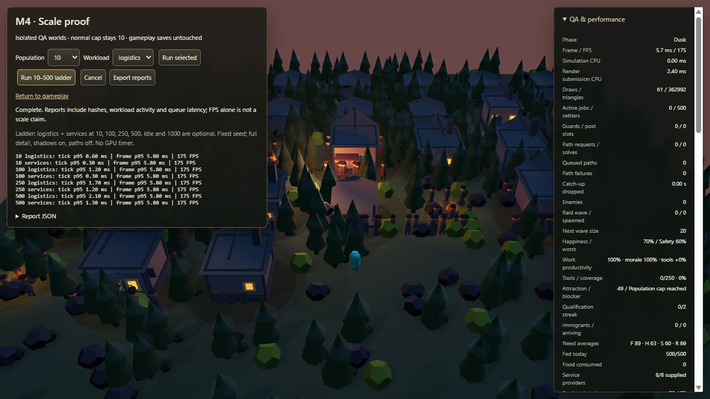

# M4 scale proof — first measured pass

## Result and supported scope

The M3.8.1 architecture now runs the measured synthetic 10/100/250/500-settler workloads with much lower scheduling cost and identical simulation results. **This is not a claim of 500-settler gameplay support.** Navigation throughput remains limited to 40 dequeued requests per simulated second, and large synchronized crowds wait many seconds to move.

The **demonstrated responsive synthetic envelope is 10–100 settlers on this machine and these two short workloads**: no dropped time, no instance overflow, completed queues, and route-wait p95 at most 2.35 seconds. This is a conservative interpretation of the evidence, not a universal latency SLA. At 250, service route-wait p95 is 5.90 seconds; at 500 it is 11.85 seconds, and Logistics ends with 249 requests still queued. Normal gameplay, immigration, spawn and save limits remain **ten**. Do not raise them from these results alone.

## Reproduce in the browser

1. Install dependencies, run `npm run build`, then `npm run preview`.
2. Open `/?benchmark=1` on the local preview URL, or the benchmark link in QA & performance.
3. Keep the tab active, use the same viewport and avoid unrelated heavy workloads. Leave the QA panel open for matching HUD measurements.
4. Click **Run 10–500 ladder**. It runs Day Logistics and Dusk Services at 10, 100, 250 and 500.
5. Each case starts from preset v2, seed 0x4e535034, and runs exactly 400 fixed 50 ms ticks: 40 warmup, 360 sampled. Speed is 1×, with the existing 100 ms frame-delta clamp and eight-step catch-up limit.
6. Export reports after completion. **Run selected** offers individual cases, Idle and optional 1000. Starting another run replaces the in-memory report list. Hidden/cancelled cases are incomplete and not reported as successes.
7. Check validity, hashes, entity/job counts, progress, route waits, outstanding queue, overflow and dropped time before reading FPS as a success signal.

Benchmark worlds use the actual Simulation, SceneRenderer and Hud. They are isolated from Game/input/persistence and cannot overwrite gameplay saves. They use a fixed 47×47 map, 20–31 buildings through 500 settlers, four roads and four residential plots, four Campfires/Taverns/Breweries and two Blacksmiths. Storage and nodes grow with population. Workers start on deterministic walkable cells; resources are abundant and production input is stocked. Logistics exercises gathering, carrying, depositing, production and supply; Dusk exercises service/shelter travel and physical recreation. Services have 72 slots, so surplus civilians shelter. Existing decorative Tavern figures are presentation, not additional simulated settlers.

These are controlled load probes, not sustainable towns. They do not exercise new construction, combat, mass immigration or topology edits during the timed window. Those existing gameplay paths retain automated regression coverage; see QA notes for browser smoke checks.

## Provenance and measurement method

- Gameplay base: `4d9097e`, `codex/m3-roads-residential-plots`, selected by the project owner after the initial M3.3 run. That older run was archived locally and is **not** mixed into these comparisons.
- Baseline: `59d8f7844dc1bbbcbed32d403cd6ca003a7b3315` — current gameplay algorithms plus isolated harness, timing probes, QA instance capacities and overflow detection.
- Optimized: `da5f1969f5b4e193035241c84e89c9bb92506427` — same presets/render fidelity plus reservation indexing, shared service plans and roster pagination.
- Raw evidence: [baseline](benchmarks/baseline.json), [optimized ladder](benchmarks/optimized.json), [500 Logistics repeat](benchmarks/repeat-logistics.json), [500 Services repeat](benchmarks/repeat-services.json).
- Machine: Windows, AMD Ryzen 7 7800X3D (8 cores/16 threads), approximately 31 GiB reported physical RAM. Installed graphics adapters: NVIDIA RTX 5070 Ti (driver 32.0.16.1692) and AMD integrated graphics (32.0.21043.5001). The active WebGL adapter was not independently identified.
- Browser: Codex in-app Chromium; exact user agent, timestamp, build/dirty flag and viewport are in each report. Viewport **1280×720 at DPR 1**; observed refresh ceiling about 175 Hz. Full current visual detail and shadows, overview camera, paths off. No dependency changes.
- Timings use `performance.now()` and nearest-rank percentiles. Simulation time is per fixed tick, including decision spikes. Decision percentiles sample 2 Hz decision ticks separately; frame simulation time includes frames with no tick. Render CPU includes state-to-instance updates and render submission, **not GPU execution time**. HUD CPU samples actual 5 Hz updates. Frame intervals include browser scheduling, layout and GPU/presentation effects but are not a GPU profile.
- Warmup is excluded from sampled FPS/stage distributions, but worst-tick and dropped-time counters include startup. Queue latency includes warmup and only requests actually dequeued; pending requests are censored, so queue depth must also be read. The queue peak is measured after each tick's two dequeues.
- Vsync-limited FPS can hide occasional stalls. Small differences near the timer resolution (about 0.1 ms) are noise. This is one baseline ladder, one optimized ladder and two repeated largest cases, not a hardware-independent statistical performance guarantee.

## Before → after

All CPU values are milliseconds. Tick p95 is across sampled ticks; maximum includes startup.

| Population / workload | Simulation tick p95 | Worst tick | Render CPU p95 | HUD CPU p95 | Mean FPS |
|---|---:|---:|---:|---:|---:|
| 10 logistics | 0.5 → 0.6 | 4.5 → 3.7 | 1.5 → 1.6 | 0.8 → 1.1 | 175.0 → 175.0 |
| 10 services | 0.6 → 0.3 | 1.7 → 1.4 | 1.5 → 1.7 | 0.9 → 1.1 | 175.0 → 175.0 |
| 100 logistics | 2.3 → 1.2 | 43.3 → 6.7 | 1.8 → 2.0 | 1.5 → 1.4 | 175.0 → 174.9 |
| 100 services | 4.0 → 0.3 | 5.9 → 1.4 | 1.8 → 2.0 | 1.4 → 1.3 | 175.0 → 175.0 |
| 250 logistics | 21.9 → 1.7 | 313.0 → 19.2 | 2.6 → 2.7 | 3.4 → 1.6 | 168.7 → 175.0 |
| 250 services | 14.8 → 1.2 | 19.7 → 1.6 | 2.7 → 2.6 | 3.7 → 1.4 | 151.7 → 175.0 |
| 500 logistics | 11.9 → 2.1 | 2140.8 → 47.9 | 3.8 → 3.7 | 7.0 → 2.6 | 153.2 → 174.6 |
| 500 services | 40.2 → 1.3 | 72.1 → 1.9 | 4.0 → 3.5 | 5.2 → 1.7 | 46.7 → 175.0 |

At 500 Logistics, decision-tick p95 fell **164.8 → 1.5 ms**. At 250 it fell **43.1 → 0.9 ms**. At 500 Dusk, per-agent scheduling dominated the former 40.2 ms tick p95; shared scheduling reduced the entire tick p95 to 1.3 ms.

Baseline dropped simulation time: 0.2202 seconds at 250 Logistics and 2.2781 seconds at 500 Logistics; zero in the other cases. The optimized ladder dropped **zero**. Optimized frame p95/p99 was 5.8 ms across all cases; baseline 500 Dusk was 45.8/51.5 ms and 46.7 FPS. The 47.9 ms optimized 500 Logistics startup tick remains a visible burst risk despite good steady-state statistics.

Separate 500-settler repeats reproduced both final hashes and navigation counts with zero dropped time. Logistics repeated at 2.9 ms tick p95, 3.7 ms render p95 and 174.9 FPS (51.7 ms worst startup tick); Services repeated at 1.3 ms tick p95, 3.0 ms render p95 and 175.0 FPS. These variations reinforce the need to distinguish steady-state cost from startup bursts.

### Navigation, entities and rendering

These counts and outcomes match before and after. Draw calls and triangles are maxima of Three.js's renderer counters, not estimates. Enemies are zero in every case; there are four persisted roads and four plots.

| Population / workload | Requests / dequeues | Peak / final queue | Route wait p95 (s) | Final jobs | Buildings / nodes | Max draws / triangles |
|---|---:|---:|---:|---:|---:|---:|
| 10 logistics | 35/35 | 2/0 | 0.05 | 10 | 20/60 | 64/41930 |
| 10 services | 10/10 | 8/0 | 0.20 | 0 | 20/60 | 61/40450 |
| 100 logistics | 325/325 | 89/0 | 1.85 | 99 | 21/100 | 64/95572 |
| 100 services | 100/100 | 98/0 | 2.35 | 0 | 21/100 | 61/93804 |
| 250 logistics | 752/752 | 222/0 | 4.65 | 239 | 25/250 | 64/197256 |
| 250 services | 250/250 | 248/0 | 5.90 | 0 | 25/250 | 61/194752 |
| 500 logistics | 1049/800 | 440/249 | 10.00 | 487 | 31/500 | 66/368560 |
| 500 services | 500/500 | 498/0 | 11.85 | 0 | 31/500 | 61/362992 |

All ladder cases have zero route failures and zero instance overflow. At 500 Logistics, workers actually gathered 2,305 units and deposited 870 units (340 Wood, 305 Food, 225 Ore); production made 16 Ale and 2 Tools. At 500 Dusk, 72 settlers had a Visiting status by tick 400 and three Ale had been consumed. State hashes, requests, dequeues and outstanding queues match all eight pre-optimization trajectories, also asserted in tests.

## Bottlenecks and changes

1. **Job assignment:** nested job scans in availability, storage, supply demand and node claims amplified the initial 500-worker assignment into a multi-second tick. JobReservations now derives all reservation/claim indexes once per decision pass and extends them after each accepted job. Building categories are shared during the pass. One stable scan chooses the best eligible gathering node instead of sorting every candidate.
2. **Dusk scheduling:** each civilian rebuilt the entire service allocation. The simulation shares that allocation within a tick and invalidates it after job updates that could change a provider. Service consumption still recomputes after movement. This preserves same-tick supplies, priority, capacity and fallback behavior.
3. **HUD:** every 5 Hz refresh generated the whole population roster, including repeated label scans and morale formatting. A 25-row page bounds the DOM work; all pages remain available and collapsed rosters skip rebuilding.
4. **Rendering/storage:** plain state arrays and existing shared instancing remain. QA capacity parameters cover character parts, cargo, timber and health bars; overflow is counted rather than silently accepting missing meshes. Current visual detail, colors, lighting and animations were preserved. Render CPU was not the dominant measured bottleneck, so no LOD or renderer rewrite was added.
5. **Navigation/fixed-step/save:** the global budget, BFS ordering, retry policy, fixed step, resource ownership and save schema remain unchanged. Optional timing instrumentation has no clock calls in normal simulation mode.

## Remaining work and limits

- Navigation responsiveness is the next scale blocker. Benchmark route-tree reuse/coalescing and bounded dispatch changes against queue-latency and deterministic correctness targets; changing throughput is a gameplay-timing decision, not a free CPU optimization.
- The assignment pass still scans candidate nodes/buildings per idle worker; startup at 500 remains roughly a frame-spanning burst. Profile staggered decision work and spatial candidate lookup before adding an index or update tiers.
- Rendering still rebuilds all instance transforms each frame, with shadows and no distance LOD. The 500-case scene submits about 363k–369k triangles. GPU time, memory, lower-end hardware and larger/dense building counts remain unmeasured.
- Entity/job lookup, per-guard assignment, combat targeting, save validation and placement connectivity still include linear scans. Small-map 20-second non-combat probes do not validate their large-scale costs.
- No long soak, many-day economy, frequent topology invalidation, mass hunger/arrival, large raid or 1000-agent browser qualification was performed. The 1000 preset exists but is deliberately not called a supported scale while 500 already has an unhealthy queue.
- Regression suite: **110 passing tests**, including 14 new scale tests. Eight frozen baseline trajectories cover all ladder cases; additional checks cover all five resources and job stages, deterministic presets/IDs, same-tick service delivery invalidation, normal cap protection, percentile calculations and stable essential-food selection.
- Vite's existing >500 kB chunk warning remains, predominantly Three.js. No new runtime or test dependencies were introduced.

