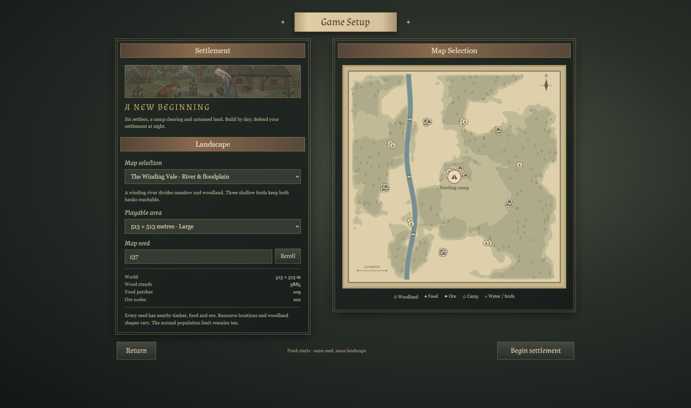

# Landscape generation and game setup

This focused pass branches from village PR #75 at 4e10961c73d9b2b7edae88797cd7378cd0845b46. It retains the current UI artwork, village rendering, M4 integration, economy and normal population cap.

## Reference and scope

The supplied Manor Lords screenshots informed the two-panel setup hierarchy and parchment geography. Its [official Steam description](https://store.steampowered.com/app/1363080/Manor_Lords/) describes landscape-led organic settlements; its [official region wiki](https://wiki.hoodedhorse.com/Manor_Lords/Regions) illustrates broad plains/woodland and distinct water-led layouts. Nightspire interprets those composition principles using original procedural cartography and existing artwork. No reference-game assets, ownership/diplomacy system or kilometer-scale world were added.

The user selected forests, meadows and water first; buildable hills/slopes are deferred. Fresh starts take priority over old-save migration.

## Player flow

- Startup: Continue settlement (when a suspended world or primary save exists), or New settlement.
- Game Setup: choose landscape, 129 / 257 / 513-cell region, and an unsigned whole-number seed. Reroll changes the seed. Large 513 / seed 137 / Verdant Marches is the default.
- The map previews the generated world, including woodland masses, actual Food/Ore clusters, water, fords and camp. Begin starts that exact world.
- Menu stops the simulation and preserves the current world in memory. Continue resumes it. After a reload Continue validates/loads the primary save. Fresh Begin does not automatically overwrite the save.
- Settlement overview → Region map retains camera travel and a Choose landscape shortcut.

## Four landscapes

| Landscape | Composition |
| --- | --- |
| Verdant Marches | Broad meadows, ragged copses, protected opening clearing |
| The Elderwood | Connected woodland masses divided by meadow rides and clearings |
| The Winding Vale | A seeded gently winding river, three dry fords, wooded banks and open meadow |
| The Mere Country | Three irregular, rotated lakes surrounded by woods and clearings |

Warped coherent fields provide broad forest masses with smaller ragged edges. Regional Food/Ore appear in ten finite deposit clusters rather than scatter everywhere; the camp retains at least 40 nearby Wood, 20 Food and 12 Ore nodes. Deterministic ranking keeps the 4,096-node limit distributed across the map. Wood and replanted saplings stay four metres from water so their working offsets remain dry.

## Water and presentation

Shared signed water boundaries feed cached grid blockers. Settlers, player and enemies use existing navigation around deep water and through dry fords. Building footprints, full-width roads, fields and residential parcels reject water; polygon checks also catch a lake enclosed inside otherwise dry edges. Load validation applies the same rules. Raids whose usual approach starts inside new water move to a nearby dry bank without changing wave sizes or timing.

The ground texture blends regional meadow/forest color and damp shoreline color. One opaque lit water mesh adds at most 512 triangles and one draw call on water maps; it replaces its geometry only when map metadata changes. Existing tree/canopy instancing and distance limits remain. No mesh per river section/lake, animated water controller, new texture asset or new runtime dependency.

Setup and HUD share original SVG cartography: marching-squares woodland washes, at most 420 ink tree markers, at most 64 deposit symbols and the same water curves as gameplay. This is static geography, not a live resource depletion census or an ownership map. Meadow color uses a 65×65 sampling lattice; the generated-map terrain texture remains 2048².

## Verification

Install, architecture checks, strict typecheck, all **225 tests**, and production build passed locally. Seven new test cases cover 36 size/seed/layout combinations, deterministic generation and save round-trips, camp resources and reachable nodes, dry ford routes/global navigation budget, water placement and forged saves, bounded finite cartography/geometry/colors, fresh gathering/carrying/depositing and dry raid spawns.

Brief production-browser checks covered setup selection → Begin → Menu → Continue and inspected the setup layout. Extended visual approval, water-bank construction/road placement, late-game economy, raids and long sessions are intentionally left for user playtesting. These checks establish correctness cases, not a new population or GPU performance envelope.

## Limits and next useful checks

- Playable floor is level. Water is a surface with shoreline coloration; no excavated riverbeds, animated waves, boats, bridges, slope restrictions or terrain editing.
- River shape is deliberately constrained away from the guaranteed camp; variation does not yet include branching rivers or arbitrary topology.
- Resource availability is bounded and clustered; long-haul balance and per-landscape attractiveness are not tuned.
- Normal cap remains 10 settlers; existing 120-building/4,096-node limits remain. The 513-cell map spans −256…256m and is not Manor Lords' full map scale.
- Generation, validation and texture baking remain synchronous and can pause setup/load/road edits. Water blockers copy into topology sets; large obstructed water worlds have not been profiled.
- No new performance measurements were taken. REGIONAL_MAPS.md contains clearly labeled historical V1 measurements; they do not describe these V2 layouts. Existing production bundle-size warning remains.
- Continue reports an invalid saved-world error; no new migration or autosave system.

Recommended playtest: compare all four layouts at one seed, reroll a few Large maps, inspect shoreline and woods in elevated/Street View, route a road through a ford, try invalid placements on water, then gather/build/save/reload/Continue. Next engineering work should follow those observations: measured setup/edit latency, shoreline polish, and long-haul economy/navigation balance before hills or greater map sizes.

