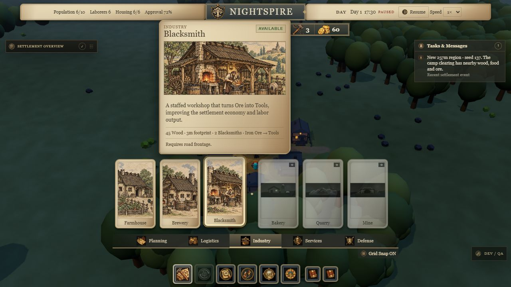
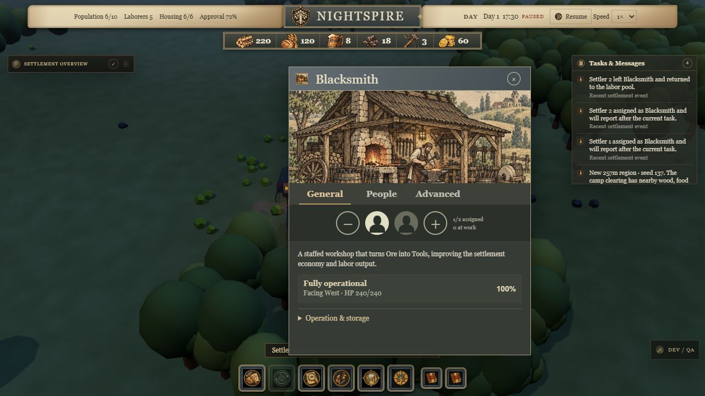

# Medieval HUD reference pass

Based on the three user-supplied Manor Lords screenshots. Starts from merged main `16d41a7`, including regional maps and current Nightspire artwork. No simulation, save, navigation, economy or renderer changes.

## Layout and controls

- Parchment status ribbon around the centered crest/title, with a separate compact resource rail.
- Tall construction cards over the world, category rail below, then small square command buttons. Names remain visible and keyboard accessible; details and affordability appear on hover/focus. Planned cards remain unavailable.
- The construction shelf stays at the bottom rather than being draggable. Building windows and settlement overview remain draggable.
- Illustrated building windows use **General / People / Advanced** tabs. Workplaces show minus, filled/empty silhouettes and plus controls using existing assignment actions and slot/laborer limits.
- General retains description, health and construction progress. **Operation & storage** expands recipes, stores, services and household operations. Its open state survives live updates and resets on selecting another building. People retains the roster; Advanced retains policies and now contains demolition.
- Existing artwork is reused. No source-game assets, fonts, dependencies or new rendering objects were added.

## Ownership

`src/game/ui/MedievalHud.css` owns the presentation layer, loaded after existing asset styles and scoped to `.medieval-hud`. Benchmark presentation is unaffected. `Hud.ts` retains event delegation, bindings and simulation actions. Disclosure state is local UI state.

## Verification

- Install, typecheck, all **188 tests** and production build passed. Existing Three.js bundle-size warning remains.
- Browser: 1280×720 and 800×600, category switching, horizontal shelf overflow, keyboard focus preview and Enter-to-select. Blacksmith selection entered placement; Inspect cancelled it.
- Blacksmith assignment 0 → 1 → 2 (plus disabled at capacity), removal 2 → 1, People/Advanced/General tabs, demolition action in Advanced, live operation disclosure and panel dragging checked.
- Final production screenshots captured; no console errors. Missing first-batch preview images and low-contrast text found during QA were fixed.
- No new simulation tests for this CSS/DOM-only pass; existing workforce regressions and browser interaction cover reused behavior.

## Limits and review

Screenshots use the existing staged QA town. Portrait cards crop landscape illustrations; custom portrait manuscript artwork would improve the reference match. Planned art remains subdued. Desktop is the target, not a touch/mobile conversion; the existing small-window rule hides Tasks. No foreground GPU or long-session performance claim is made.

Next review: compare the shelf at 1280×720 and 1920×1080, inspect staffed and unfinished buildings, and inspect house/trade/stockpile detail panes. Follow with portrait-format artwork and spacing refinements.
