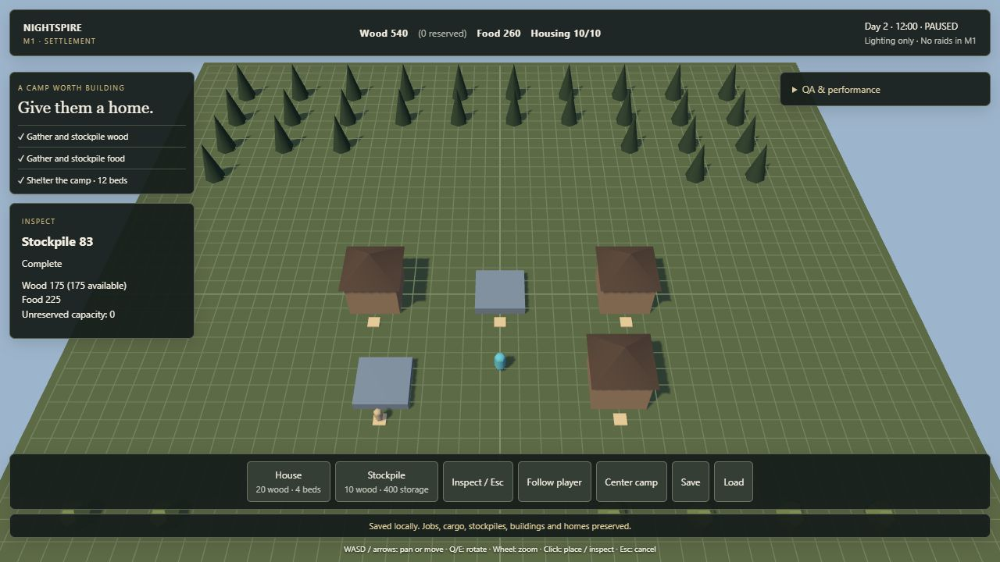

# M1 verification and handoff

## Automated checks

Verified on 2026-09-26 with Node 24.19.0 and npm 11.17.0 on Windows.

- Baseline: npm install, npm run typecheck and npm run build passed; browser rendered the original foundation.
- Final: npm run typecheck, npm run build and npm test pass.
- Install audit: zero reported vulnerabilities at installation.
- No runtime or development dependency was added; package-lock.json now records the pinned installation.
- Browser testing used the connected Codex browser because agent-browser was not installed.

Fifteen renderer-independent regression tests pass. The original eight cover:

1. Ten settlers, zero starting inventory, three houses and one additional stockpile; both resources gathered/deposited; 70 wood delivered; ten housed; every task phase observed; conservation and route budget checked.
2. Save/load during gathering work, gathering with cargo, delivery before pickup, delivery with cargo, and construction; resumed jobs complete without resource loss/duplication.
3. Two competing sites wait for resources and never double-reserve wood.
4. Full storage stops new gathering; constructing another stockpile restores throughput.
5. Invalid footprint/actor/resource/bounds/entrance placement and a route-closing enclosure are rejected.
6. Placement invalidates in-flight routes and workers continue around the new obstacle.
7. Exhausted resources produce idle workers without invalid jobs.
8. Malformed/incompatible saves are rejected without changing the original state.

M1.1 adds seven review-hardening checks covering blueprint cancellation/refunds, refusal to lose refunds when storage is full, a 12,000-tick conservation run, bounded stock-target gathering plus construction demand, migration of earlier version-1 saves, and blocked-route retry cooldown/recovery.

## Browser playthrough

The following were actually exercised through the UI:

- Started with six settlers and empty storage; observed gathering, visible cargo, hauling and rising wood/food counts.
- Spawned to ten settlers; spawn became disabled at the cap.
- Used 4× speed and the navigation-path overlay; inspected construction progress.
- Placed three houses and an additional stockpile by clicking the world.
- Saved while carrying resources and with three unbuilt sites, then reloaded the page and loaded that save.
- Resumed construction: completed/sites counter reached 4/0, delivered materials reached 70 wood, housing reached 10/10 with 12 beds.
- Paused at tick 1953; QA resource grant changed stock from 185 wood / 90 food to 235 / 115, respecting incoming capacity reservations. Load restored 185 / 90 and the same saved jobs/cargo/tick.
- Used set-hour at pause to set exactly 12:00.
- Switched camera modes, moved the player from z=5 toward the camp, and verified movement stopped at the stockpile boundary near z=1.5.
- Integrity audit reported PASS; path failure counter remained zero.
- Full storage later left ten workers idle with a visible storage-full reason.

Short keyboard taps initially could fall between render frames. Input now buffers releases until one frame consumes the key; the browser recheck confirmed movement.

The final production preview repeated the ten-settler, three-house and stockpile scenario, reaching 4 completed structures, 70 delivered wood and 10/10 housed. Overlapping placement showed a red preview and a rejection message. A fresh production browser session reported no console warnings or errors.

## Observed performance

These are live HUD samples from this development browser, not a cross-hardware benchmark or a guarantee:

- Ten settlers, 60 initial resource nodes, starter camp plus four constructed structures.
- Around 5.7–5.9 ms frame interval (~169–175 FPS in the connected browser).
- Smoothed simulation CPU samples ~0.00–0.04 ms per rendered frame.
- Smoothed render submission/sync CPU samples ~0.16–0.26 ms.
- About 18–20 draw calls and 3,874–4,370 triangles, varying with cargo, depleted nodes, selected object, paths and construction state.
- Zero path failures; sampled queue depth zero; no catch-up time dropped during the sampled playthrough.
- No skeletal animation or enemies.

Simulation CPU includes many frames without a fixed step; it is not a worst-tick measurement. Render CPU does not measure GPU execution. A long-run percentile benchmark remains follow-up work. The HUD now separately exposes path requests and path solves per frame plus queue depth.

## Known limitations and review targets

- One primary browser-local save plus one rotating backup slot; validated JSON export/import is available. There is no autosave, cloud sync, slot manager, or general future-version migration.
- Six initial / ten maximum settlers; 80 building cap; fixed 47×47 grid.
- Finite resources and shared storage capacity. Blueprint cancellation is supported for unfinished sites; completed-building demolition, regrowth, consumption, hunger and immigration are not.
- One constructor per site and one gatherer per node; job-class priorities are fixed, while wood/food gathering is bounded by player-controlled stock targets plus outstanding construction demand.
- Resource vegetation is traversable, NPCs can overlap, and player collision uses occupied grid cells rather than a character physics capsule.
- Elevation/follow camera foundation only; no camera-obstacle collision, combat or character animation.
- Global BFS and linear searches are deliberately bounded M1 choices. Do not claim support for hundreds of workers without profiling.
- Instance transforms rebuild per frame; HUD/path overlays update at 5 Hz. Profile before introducing incremental rendering or spatial indexes.
- Vite's >500 kB minified chunk warning remains (about 578 kB / 148 kB gzip in this pass). It also occurred in the baseline and is mostly the Three.js runtime.
- M2.3 fortification/damage/repair is implemented. Permanent defender death, complete destruction of core economy buildings, wall drag placement, gate controls, towers/siege systems and final combat presentation are not.

## M1.1 verification

Post-handoff M1.1 verification on 2026-09-26:

- Local renderer-independent suite: 15/15 tests passed, including the 12,000-tick run.
- GitHub Actions CI run #8 passed dependency install, strict typecheck, all tests, and production build.
- Browser-facing Game/Hud changes also passed a strict local contract typecheck against the unchanged renderer API.
- The live Pages build still needs the final M1.1 user playtest after deployment; do not treat that as already visually verified.

## Highest-value follow-ups before M2

1. User-playtest the M1.1 Pages revision: stock targets, blueprint cancellation, backup/export/import and normal camera/placement behavior.
2. Tune camera/placement/task pacing from that feedback rather than adding more simulation breadth.
3. Add a repeatable percentile-style performance capture if needed before population limits increase.
4. Then begin a deliberately small M2 dusk → first raid → morning repair slice.

## M2.0 verification

GitHub Actions CI run #15 verified the M2.0 code on 2026-09-26:

- dependency install passed
- strict TypeScript check passed
- 20/20 renderer-independent simulation tests passed
- production Vite build passed

The five M2.0 tests cover exact phase boundaries, cargo-safe dusk shutdown, civilian sheltering, guard-post reporting, daylight work resumption, and legacy M1.1 role migration.

The live Pages deployment is intended for user-facing verification of phase controls, Guard Post placement, role assignment, and visible dusk/night movement. Enemies and combat are deliberately absent from this slice.

## M2.1 verification

GitHub Actions CI run #18 verified the implementation on 2026-09-26:

- dependency install passed
- strict TypeScript check passed
- 26/26 renderer-independent simulation tests passed
- production Vite build passed

The six M2.1 tests cover one-wave-per-day spawning, shared bounded navigation to the settlement, daylight retreat and next-day respawn, active-raid save/load without duplication, migration of M2.0 saves, and placement rejection on an active raider cell.

The Pages playtest should verify the visible behavior: jump to Night, observe 12 dark-red raiders enter from outside the settlement and converge on the camp, inspect their statuses/routes, then jump to Dawn/Day and confirm they retreat. **Next raid** advances the QA scenario to another wave. Combat is intentionally not part of this slice.

## M2.2 verification

GitHub Actions CI run #23 verified the implementation on 2026-09-26:

- dependency install passed
- strict TypeScript check passed
- 32/32 renderer-independent simulation tests passed
- production Vite build passed

The six M2.2 additions cover player melee damage/kill, guard-raider damage exchange, player downing and recovery on night exit, final-raider wave clearing, combat-state save/load, and migration of M2.1 saves to default combat fields. The older guard-post schedule test is explicitly isolated from raid spawning so schedule and combat behavior remain independently tested.

Pages playtest focus: assign guards, jump to Night, observe guards intercept nearby raiders, switch to Follow player, approach a raider and press Space, inspect health/status changes, clear or survive the wave, then jump to Dawn/Day and verify downed defenders recover.

## M2.3 verification

GitHub Actions CI run #38 verified the implementation on 2026-09-26:

- dependency install passed
- strict TypeScript check passed
- 39/39 renderer-independent simulation tests passed
- production Vite build passed

The seven M2.3 additions cover friendly-vs-hostile gate blocking (including the unfinished-blueprint exploit), full-health wall construction, raider destruction of a wall and opening of the hostile route, timber-consuming daylight repair that closes the breach again, critical-floor behavior for core economy structures, retargeting after a core structure reaches 1 HP, and migration of older saves to structure/repair state.

Existing long-run conservation now explicitly includes lifetime repair timber consumption instead of hiding that resource sink. The older raid-movement regression accepts the terminal no-target state after all available core structures have reached their critical floor.

The Pages build still needs user-facing verification after deployment. Recommended playtest: build several walls plus a gate, enable paths, trigger Night, watch raiders hit/breach the perimeter, inspect structure HP/hit flashes, then go to Day and observe workers carry wood to damaged structures. The QA **Damage selected structure** button provides a deterministic repair test.
