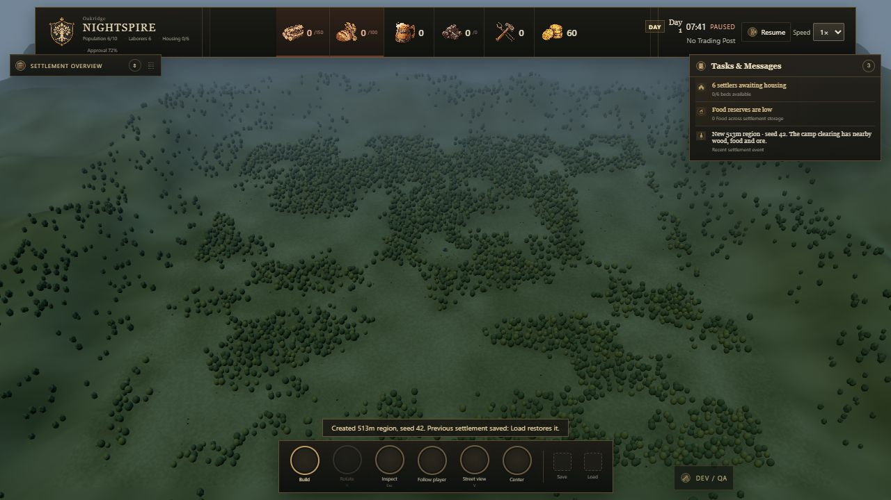

# Seeded regional maps

This branch starts from UI PR #41 at `974ce09023c5ac64f6a1bed1806aa32569063441`, then incorporates newer UI patches through `5aad764`. The permanent minimap remains disabled; regional navigation is available inside the optional New region panel. It adds playable seeded landscapes, not a population-cap increase.

## Reference and scope

The [Manor Lords landscape reference](https://www.videogamer.com/wp-content/uploads/manor-lords-map-size-mid-view.jpg) shows connected open meadows, uneven woodland masses and separated resource areas. Its [official description](https://store.steampowered.com/app/1363080/ManorLords/?l=english) also emphasizes landscape-led settlement planning. Nightspire uses those broad composition principles with original procedural placeholder geometry; no Manor Lords assets were copied.

Choose **Settlement overview → New region**: numeric seed, **Meadows & copses** or **Woodland clearings**, and 129 / 257 / 513 grid cells per side at one-metre spacing. The largest playable coordinates are −256…256m: approximately 119× the original grid area, not a claim of Manor Lords' full world scale. Normal startup uses 257 / seed 137 / Meadows.

Starting a region validates it and saves the current settlement before replacement. **Load** restores that previous settlement until another Save. **Region view** zooms out, the minimap jumps to a location and marks camera focus, and **Center** returns to camp. Seed/size/preset persist in normal JSON saves. Older saves and M4 benchmark scenarios retain their 47-cell bounds and original layouts.

## Generation and presentation

- Coherent noise at two spatial scales shapes woodland density and ragged edges, with a protected central clearing.
- Irregular nearby copses guarantee 40 Wood nodes, 20 Food nodes and 12 Ore nodes. Regional candidates add woodland and resource clusters. Deterministic ranking distributes the 4,096-node cap across the whole map rather than truncating one edge.
- All trees inside the region are ordinary harvestable resource nodes. Resource vegetation retains existing non-blocking navigation semantics.
- Broadleaf crowns/trunks use two shared instanced batches, distance simplification and view-distance rejection. No per-tree controllers or meshes.
- Meadow albedo varies at regional and local scales, sharing the existing organic-road terrain texture. A cached mesh and capped instanced canopy batch continue the landscape into distant hills.
- The playable floor is **flat**. Raised hills are scenery outside its boundary. Rivers, slope rules, terrain leveling, biomes, multiple owned regions and kilometer-scale streaming are not implemented.

## Navigation and bounds

Map bounds now travel with the save and govern placement, player movement, services, camera travel and immigration. Fixed integer cell keys avoid collisions between larger coordinates. Generated regions use one reusable typed-array A* workspace owned by the existing shared navigation service; the global two-solves-per-tick budget stays unchanged. Legacy benchmark routing still uses the original BFS, preserving its deterministic workload.

Connectivity validation still floods the reachable region, using packed arrays rather than an object/parent per cell. This is done for construction/load checks, not for every NPC every frame. Local A* visits 16 cells for a 15-step unobstructed route even on the 513-cell map; a corner-to-corner test visits 1,021 cells rather than all 263,169 cells.

Raids approach from approximately 22m outside the settlement's occupied edge on the chosen side, clamped to playable bounds. Spawning them at the new region boundary would make opening raids miss the entire night. Wave sizes, combat, targeting and day length stay unchanged. Immigrants enter at the actual map boundary and therefore take longer to arrive.

## Measurements and verification

Run `npm test`, then `node scripts/map-benchmark.mjs`. [Raw local results](map-benchmark.json): Node 24.19.0 / Windows, five warmups and 30 samples, seed 42 / Woodland. These are CPU microbenchmarks with no blockers, not GPU or populated-town performance promises.

| Size | Nodes | Generation median / p95 | Region-spanning A* median / p95 | Connectivity median / p95 |
| --- | ---: | ---: | ---: | ---: |
| 129 | 963 | 0.448 / 0.719ms | 0.067 / 0.112ms | 0.324 / 0.404ms |
| 257 | 3,121 | 1.408 / 1.811ms | 0.085 / 0.263ms | 1.337 / 2.009ms |
| 513 | 4,096 | 2.711 / 3.764ms | 0.162 / 0.317ms | 5.081 / 6.012ms |

The suite has **188 tests**, including nine new map regressions: repeatability, 24 size/seed/preset combinations, near-camp resources, save round-trips, remote placement, shortest-path equivalence, disconnected routes, navigation budgets, regional connectivity, physical remote construction, raid approach and terrain cache changes. Install, strict typecheck and production build also passed. The existing Three.js bundle-size warning remains.

Production-browser checks exercised 257m startup, 129m generation and 513m seed-42 Woodland generation, overview/Street View, minimap travel to x=44m, a 10m road beyond the old camp boundary, local Save/page reload/Load, gathering/depositing (55 Wood and 9 Food observed), and the integrity audit. No console errors were captured. The embedded background browser throttled animation frames, so its FPS and dropped-time readings are not valid foreground performance evidence. A foreground long-session GPU/latency check remains necessary.

## Budgets and remaining limits

- Maximum 4,096 resource nodes; unchanged 10 settlers / 120 buildings / 40 fields / 200 roads. A larger land area does not imply larger population support.
- Generated-region road/meadow texture is fixed at 2048², approximately 56MiB retained CPU field/surface data plus 21.3MiB GPU mipmapped albedo; edit/load scratch buffers are additional. Legacy texture stays 1024². At 513m, narrow roads lose some close-up edge detail compared with the old small map.
- Two region tree batches cap at 8,192 crowns and 4,096 trunks. Distant scenery adds one 12,288-triangle ground mesh and at most 1,600 low-detail crowns. Region overview disables the small local shadow map; close views move it with the camera.
- Generation/road texture rebuilds are synchronous and can hitch on load or road edits. A tiled terrain cache is the next useful rendering improvement if measured edit latency warrants it.
- Full connectivity checks and long wall drags can be more expensive on the largest map. Dense obstructed routing, large populated settlements, worst-case road networks and extended regional raid balance are not yet profiled.
- Minimap woodland is a cached landscape-density guide, not a live census of depleted trees. Resource regeneration, fertility, slope navigation and terrain editing remain future work.

Recommended next work: foreground GPU profiling at all three sizes; road texture tiling if needed; terrain height/buildability rules; long-haul economy and raid pacing on expanded settlements.

